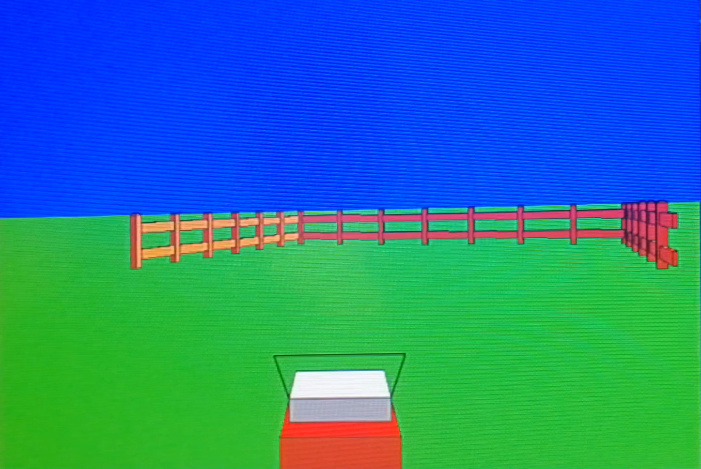
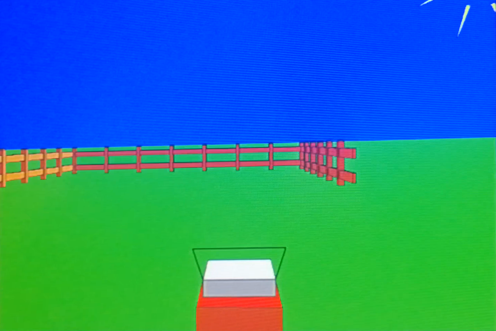
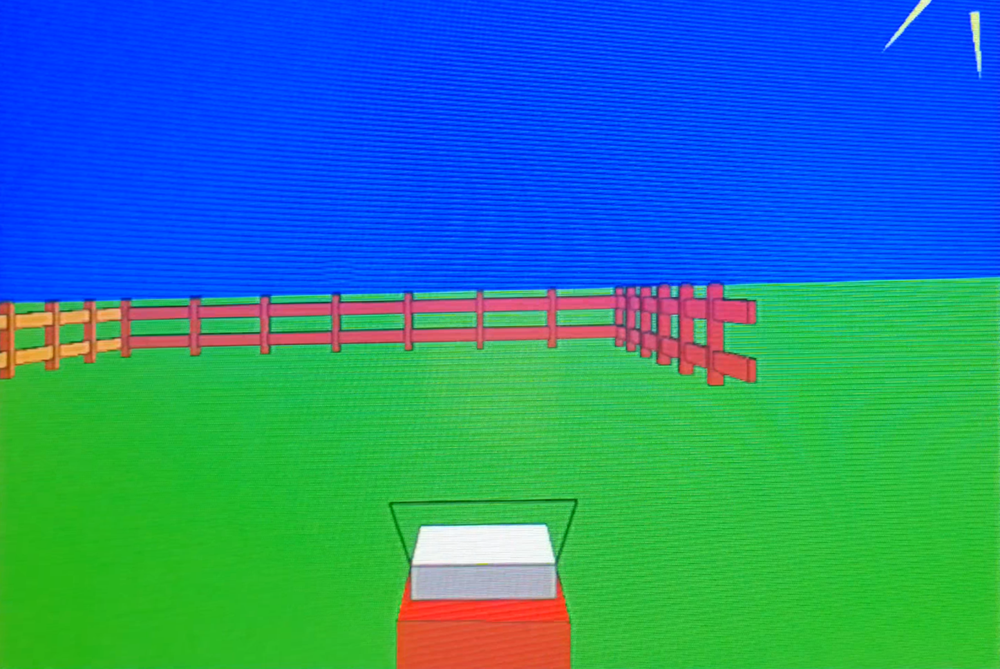
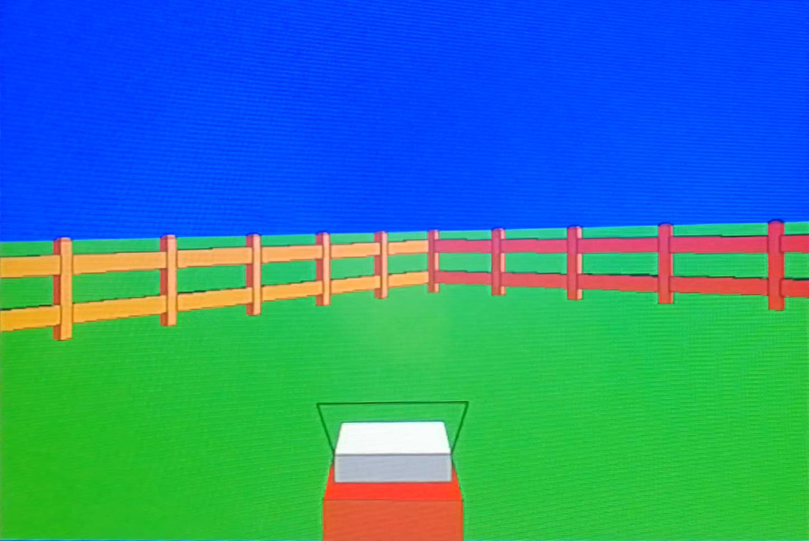

# Kosilica
Ovo je stari projekat iz prve godine fakulteta, nazalost izgubljena je konacna verzija koda i biblioteke koriscene u projektu :'( ...

---



3D Objekti se sastoje od 
- niza verteks(pozicija3D, pozicija2D-temp)
- niza poligona(indeksi verteksa od kojih su sastavljeni kao i materijal)
- pivot(3D tacka oko koje se vrse lokalne rotacije i skaliranje)
- pravac(Vektor koji pokazuje pravac modela)
- naziv modela

Od tih modela se mogu praviti instance, instance u sebi sadrže pointer na model, kao i dodatne transformacije tog modela. Tako se nizovi Verteksa i Poligona mogu samo jednom čuvati, a renderovati na više mesta.

---

Kada se u main-u generišu modeli preko funkcija kao što su:

```c
void MakeCube(struct Vertex* vertices, unsigned int PocetniVerteks, struct QuadPoly* QuadPolygons, unsigned int PocetniQuadPoly, int x, int y, int z, struct Material* _Materijal)
```
koja prima niz poligona i verteksa koje će da postavi na ćoškove kocke i dodeli materijal poligonima

for petljom se generiše ograda oko kosilice, a ručno se nameštaju ručke, i telo kosilice.

---

Kretanje kosilice se vrši tako što se svakog frejma čitaju ulazi i prema njima se pomeraju transformacije kosilice

```c
TempPivot = Kosilica.Pivot;
TempPivot = SaberiVector3D(TempPivot, NapraviVektor3D(-BrzinaKosilice* Kosilica.Pravac.x, -BrzinaKosilice* Kosilica.Pravac.y, -BrzinaKosilice* Kosilica.Pravac.z));

if (TempPivot.x > GraniceKosiliceX) TempPivot.x = GraniceKosiliceX;
else if (TempPivot.x < -GraniceKosiliceX) TempPivot.x = -GraniceKosiliceX;
if (TempPivot.z > GraniceKosiliceZ) TempPivot.z = GraniceKosiliceZ;
else if (TempPivot.z < Kosilica.BoundingRadious) TempPivot.z = Kosilica.BoundingRadious;

TranslateModel3D(&Kosilica, OduzmiVector3D(TempPivot, Kosilica.Pivot));
```

nakon toga se pozicija kamere postavlja iza kosilice

```c
BozePomozi_Scena.Kamera.Pozicija = NapraviVektor3D((-600 * Kosilica.Pravac.x) + Kosilica.Pivot.x, 200, (-600 * Kosilica.Pravac.z) + Kosilica.Pivot.z);
BozePomozi_Scena.Kamera.Pravac = Kosilica.Pravac;
```

---

Kada su modeli postavljeni, poziva se funkcija DrawScene. 

Scena se sastoji iz svih modela koji trebaju da se renderuju, kao i kamera iz koje je scena renderovana.
```c
void DrawScene(struct Scena* _Scena, int frameNumber)
```
DrawScene prima scenu, kao i broj frejmova, koje koristi za jednostavne animacije, kao što je rotiranje zraka sunca tokom vremena.





Zato što je ovaj program pisan u c-u za procesor, a ne grafičku, optimizovan je da za renderovanje prvo modele sortira po udaljenosti od kamere. Modeli se renderuju od najdaljeg do najbližeg, a potom se svakom modelu sortiraju svi poligoni i renderuju od pozadi. 

Renderovanje modela prvo primenjuje transformacije pretvaranjem ga na Screenspace, a potom cull-uje poligone koji ne gledaju ka kameri.

BackfaceCull se vrši gledanjem da li su projektovani verteksi dati u smeru kazaljke na satu, i ako nisu, neće da ih crta. P je tačka poligona u screenspace pomerena tako da je prva P0 u koordinatnom početku, dato je:

$$ cos = \frac{P1.x}{len(P1)}$$
$$ sin = \sqrt{1-cos^2}$$
$$ Rez = P2.y*cos - P2.x*sin$$

Pošto se gleda da je tačka 0 u na koordinatnom početku, cos i sin predstavljaju ugao između x ose i prave P0-P1
Kad je prona]en taj ugao, treća tačka se rotira za taj ugao unazad, tako da trougao leži sa pravom P0-P1 preklopljenom sa x osom. Ako je P2 posle rotacije iznad x ose, to jest, P2.y > 0, onda je trougao dat u smeru kazaljke i neće biti cull-ovan, a suprotno hoće.

---

Poligonima koji su preživeli culling :skull: su spremni za primenu osvetljenja. 

Prolazi se kroz sva svetla, računa se standardni skalarni proizvod normale poligona i pravca svetla kako bi se izračunao ugao. Množi se cos ugla sa bojom svetla, bojom materijala i intenzitetom svetla i akumulira za sva svetla. Pošto biblioteka podržava samo određene boje, poligon posmatra koja od dostupnih nijansi joj je najbliža i uzima tu. Predstavlja boje kao 3D koordinate i računa udaljenost, za to nije potrebno korenovanje jer ne utiče na to koja je najbliža.

---

